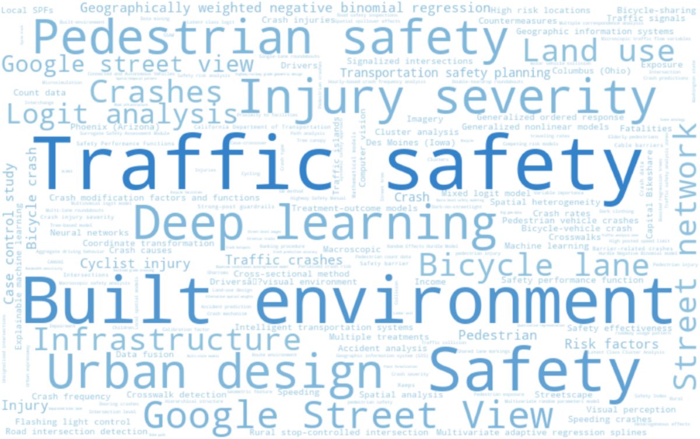
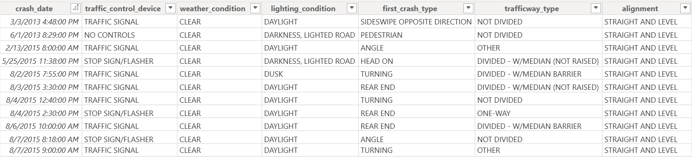
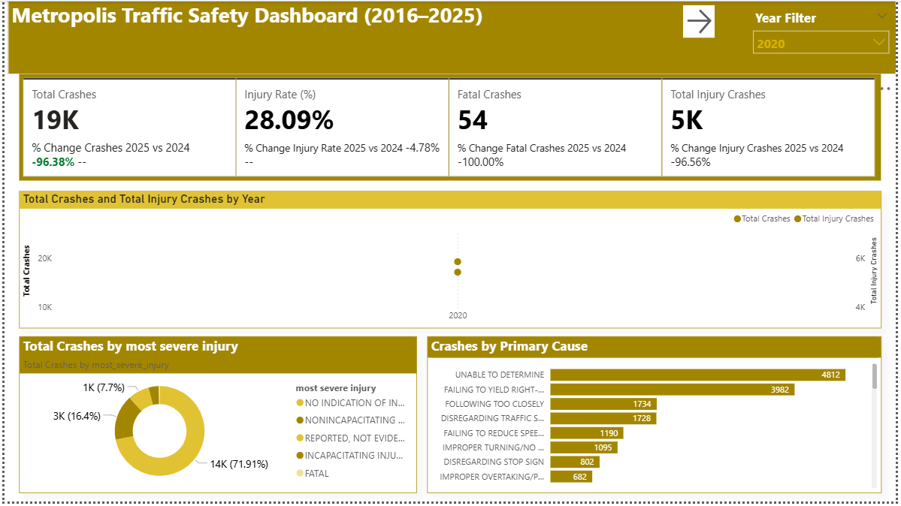

# Metropolis-Traffic--Safety--Report-2016-2025

# Executive Summary
This accident report provides an in-depth analysis of traffic crash patterns in the City of Metropolis between January 1, 2016, and December 31, 2025. The study examines trends in accident frequency, severity, and contributing factors over the ten-year period. Key findings highlight fluctuations in crash rates influenced by population growth, road infrastructure changes, and enforcement policies. The analysis identifies high-risk locations and time periods, as well as common causes such as speeding, distracted driving, and impaired driving. Recommendations are provided to enhance road safety through improved traffic management, public awareness campaigns, and targeted infrastructure upgrades.

# Business Context
The City of Metropolis has experienced significant urban growth and increased vehicle usage over the past decade, leading to rising concerns about road safety and traffic management. Understanding traffic crash patterns is essential for city planners, transportation authorities, and policymakers to make data-driven decisions. This analysis supports strategic planning by identifying key risk factors, optimizing resource allocation, and guiding investments in infrastructure and safety initiatives to reduce accidents and improve overall mobility within the city.

# Objectives
- To analyze traffic crash trends in Metropolis from 2016 to 2025.
- To identify key causes and contributing factors of road accidents.
- To determine high-risk locations, times, and conditions for crashes.
- To assess the effectiveness of existing traffic safety measures.
- To provide data-driven recommendations for improving road safety and reducing accident rates.

# Data Overview
The analysis is based on the dataset traffic_accidents.csv, which contains detailed records of traffic crashes in Metropolis from January 1, 2016, to December 31, 2025. Each record captures crash characteristics, environmental conditions, and resulting outcomes.

#Data Preview

# Key Findings
- A total of 172,000 crashes were recorded in Metropolis between 2016 and 2025.
- The overall injury rate was 26.81%, with 46,000 crashes resulting in injuries.
- There were 299 fatal crashes during the period, highlighting the continued risk to public safety.
- Both crashes and injuries increased sharply from 2018 to 2024, before dropping to their lowest levels in 2025.
- The leading cause of crashes was recorded as “Undetermined”, followed by failure to yield right-of-way, indicating challenges in both driver behavior and crash reporting accuracy.

# Dashboard

